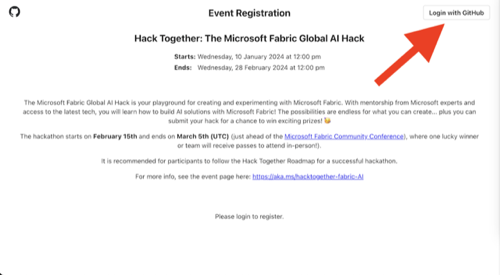

# Access Azure OpenAI for Hack Together, for Free!

**We've made it quick and easy to get access to Azure OpenAI models for the duration of Hack Together!**

By using our Azure OpenAI Proxy service you'll get access to keys and endpoints that work just like the real ones you get from using the Azure Portal and Azure OpenAI Studio to deploy your own models. 

When you get access to Azure OpenAI yourself, all you need to do is switch over your endpoints and keys to get up and running on your own resources

Here you'll see how to **[get started](#get-started)** by gaining access to our proxy server. Then see how to **[get hacking](#Get-Hacking)** using the endpoint, key, and models. You will also find some examples here for each of the models and how to use them, for Python and .NET. 

**Got Stuck?** If you have any improvements for these instructions let us know in the [GitHub Issues](https://github.com/microsoft/Hack-Together-Fabric-AI/issues) so we can make them better for everyone.

## Get started
To gain access:

1. **Register for this event** at this URL: [https://aka.ms/Hacktogether-AI-register](https://aka.ms/Hacktogether-AI-register) 

2. **Login with GitHub** using the button in the top-right corner

3. Once logged in, you have access to the your API key for this event, click the copy icon. **Keep your key handy, for the following steps and for your hacking!**  

4. **Go to the AI Proxy Playground** at this URL: [https://aka.ms/Hacktogether-AI-playground](https://aka.ms/Hacktogether-AI-playground)

5. **Enter your API key** in the text box in the top-right corner and click ***Authorize***

6. **You should now see the event name** "Hack Together Fabric AI" in the top-right corner!

7. **You're ready to test your set up**, do this on this page by writing a message in the **Chat Session**. You should receive a message back in a few sedconds!

8. **Once you receive a message you know you are ready to hack!**

## Get Hacking 
### Using the Endpoint and Key
To get hacking with AI this event you'll need both the endpoint and key to put into your own code creations! 

> ### Key Event Info
> **Endpoint**: https://polite-ground-030dc3103.4.azurestaticapps.net/api/v1
>
> **Key:** Use the key you got in step 3 above.
> 
> **Never commit your keys to a Git repository or share them publically.**

### Model details
For this event you have access to the four models below. You'll need to use the **model names from the table** below in your code. 
*You have up to 2000 requests per model per day.*

| Model  | Model Name  | Docs | Example (Python)*| Example (.NET)** |
|---|---|---|---|---|
| GTP-3.5  |  gtp-35-turbo | [GTP-3.5 Docs](https://learn.microsoft.com/en-us/azure/ai-services/openai/concepts/models#gpt-35) | [Azure OpenAI Chat - Python ](https://github.com/microsoft/azure-openai-service-proxy/blob/main/examples/python/openai_sdk_1.x/azure_openai_chat.py) | [Azure OpenAI Chat - .NET ](https://github.com/microsoft/azure-openai-service-proxy/tree/main/examples/dotnet/azure_chat_completions) | 
| GTP-3.5 (Turbo) |  gtp-35-turbo-16k | [GTP-3.5 Docs](https://learn.microsoft.com/en-us/azure/ai-services/openai/concepts/models#gpt-35) | As above, change model name | As above, change model name | 
| GTP-4 |  gtp-4 | [GTP-4 Docs](httphttps://learn.microsoft.com/en-us/azure/ai-services/openai/concepts/models#gpt-4-and-gpt-4-turbo-preview) | As above, change model name | As above, change model name |
| Embeddings |  text-embedding-ada-002 | [Embeddings Docs](https://learn.microsoft.com/en-us/azure/ai-services/openai/concepts/models#embeddings-models) | [Azure OpenAI Embeddings - Python ](https://github.com/microsoft/azure-openai-service-proxy/blob/main/examples/python/openai_sdk_1.x/azure_openai_embeddings.py) | [Azure OpenAI Embeddings - .NET ](https://github.com/microsoft/azure-openai-service-proxy/tree/main/examples/dotnet/azure_openai_embeddings) |
| DALL-E 4 |  dall-e-3 | [DALL-E Docs](https://learn.microsoft.com/en-us/azure/ai-services/openai/concepts/models#dall-e-preview) | [Azure OpenAI DALL-E - Python ](https://github.com/microsoft/azure-openai-service-proxy/blob/main/examples/python/openai_sdk_1.x/azure_openai_dalle3.py) | [Azure OpenAI DALL-E - .NET ](https://github.com/microsoft/azure-openai-service-proxy/tree/main/examples/dotnet/azure_openai_dalle) |

*The models we are using are all hosted in the Sweden Central region. You won't need that information for your hacking purposes.*

#### More Python Info*
For more guidence on using Python with Azure OpenAI you can check out the [OpenAI Python API library](AzureOpenAI) on PyPi for the docs, how to set up your environemnt variables, and for some simple examples. 

*This will give you an explination of how to set up a .env file to store your keys and endpoints and to use dot_env the library to access your keys and enpoints (this is used in the Python examples listed in the table).*

#### More .NET Info**
For more guidence on using .NET with Azure OpenAI, check out the [Azure OpenAi client Library for .NET](https://learn.microsoft.com/en-us/dotnet/api/overview/azure/ai.openai-readme?view=azure-dotnet-preview). 

To run the examples from the table above you will need to add two envrionement variables:
YOUR_AZURE_OPENAI_PROXY_URL , set this to the endpoint provided above. 
YOUR_EVENT_AUTH_TOKEN , set this to your event key.
