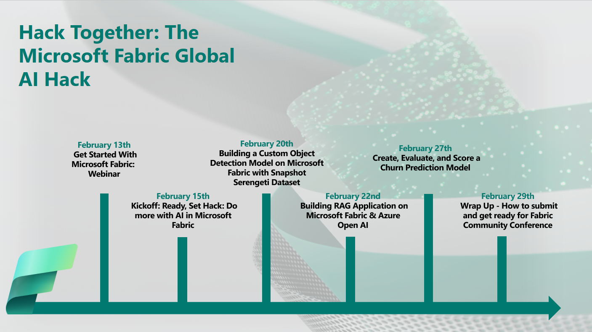

# Hack Together: The Microsoft Fabric Global AI Hack

## Introduction

🛠️Build, innovate, and #HackTogether!🛠️ It's time to get started building AI solutions with Microsoft Fabric. 🔥

The Microsoft Fabric Global AI Hack is your playground for creating and experimenting with Microsoft Fabric. With mentorship from Microsoft experts and access to the latest tech, you will learn how to build AI solutions with Microsoft Fabric! The possibilities are endless for what you can create... plus you can submit your hack for a chance to win exciting prizes! 🥳

The hackathon starts on **February 15th** and ends on **March 4th** (just ahead of the [Microsoft Fabric Community Conference](https://fabricconf.com/) - where one lucky winner or team will receive passes to attend in-person!). It is recommended for participants to follow the Hack Together Roadmap for a successful hackathon.

## Hack Together Roadmap

Follow the steps below to successfully complete the hackathon.

### #00 - Prerequisites

**Register to for the Microsoft Fabric Global AI HackTogether event**: https://aka.ms/hacktogether/fabric-ai/register

**You will need to have access to a Microsoft Fabric capacity. If you don’t have one, you can obtain a Microsoft Fabric trial license by following these [instructions](https://aka.ms/upgrade-to-fabric).** 

**Introduce yourself**, we'd like to get to know you! 🥳 [Join the Hack Together discussion board on the Microsoft Fabric Community site](https://aka.ms/FBC_HackTogether)!

**Planning on hacking with Microsoft Fabric + Azure OpenAI?** We're able to offer no-cost, limited access to Azure OpenAI - no Azure account needed. We will have more details as we near closer to the event start date.

### #01 - Start hacking on February 15th
**Either team up (max 3 team members) or fly solo** to join the hacking! Make sure to [register for Hack Together](https://aka.ms/hacktogether/fabric-ai/register) before starting to build your project.

**Get access to our free Azure OpenAI resources** via our proxy. Go to our [AI Access Page](AI_access.md) to register for your own key for this event. Then see how to get set up, get examples, and start hacking!

### #02 - Join live sessions for learning and inspiration

Note: These links will go live as we near the event start date.

* **February 13th @ 10 AM PST - Join live: [Fabric Webinar Series: Getting Started with Microsoft Fabric in 60 Minutes](https://aka.ms/fabric-sys-init)**
* **February 15th @ 9 AM PST - Join live: [Fabric AI Hack Together Kickoff: Ready, Set Hack: Do more with AI in Microsoft Fabric](https://aka.ms/hacktogether/fabricai/session1)**
* **February 20th @ 9 AM PST - Join live: [Fabric AI Hack Together Workshop - Building a Custom Object Detection Model on Microsoft Fabric with Snapshot Serengeti Dataset](https://aka.ms/hacktogether/fabricai/session2)**
* **February 22nd @ 9 AM PST - Join live: [Fabric AI Hack Together Workshop - Building RAG Application on Microsoft Fabric & Azure Open AI](https://aka.ms/hacktogether/fabricai/session3)**
* **February 27th @ 9 AM PST - Join live: [Fabric AI Hack Together Workshop - Create, Evaluate, and Score a Churn Prediction Model](https://aka.ms/hacktogether/fabricai/session4)**
* **February 29th @ 9 AM PST - Join live: [Fabric AI Hack Together Wrap Up - How to submit and get ready for Fabric Community Conf](https://aka.ms/hacktogether/fabricai/session5)**

### #03 - Submit your project until March 3rd 23:59 PM PST

You may submit your project here when it's ready: 🚀 [Project Submission](https://github.com/microsoft/hack-together-fabric-ai/issues/new?assignees=&labels=&projects=&template=project.yml&title=Project%3A+%3Cshort+description%3E)

Check out this video for step by step project submission guidance: [Project Submission Video](https://github.com/microsoft/hack-together-teams/assets/3199282/572ea387-61ec-4b77-9885-23b5b2bd39bd)

There will be a grand prize winner out of all projects as well as a 'Best Real-World AI application built with Microsoft Fabric', 'Best use of Microsoft Fabric + Azure OpenAI', and 'Best use of Copilot for Microsoft Fabric' so it is important to align your hack to one of these categories.

We'd love to hear about your project, [tell us what you are working on](https://aka.ms/FBC_HackTogether)!

For a great example of a community developed solution that demonstrates a high-quality submission for this Hackathon, check out:  

[Tracking International Space Station with Microsoft Fabric](https://github.com/anshulsharmas/fabric-iss-demo)

This solution is a great example because it:
* Solves a real-world problem in a novel way using Microsoft Fabric
* Is shared publicly via a GitHub repo
* Has clear documentation and instructions to reproduce the solution 
* Includes a [video](https://www.youtube.com/watch?v=-HhU7yLyuUU) demonstrating the solution in action

That said, this solution could be better aligned to the Hackathon by:
* Incorporating Azure OpenAI into the solution
* Making use of Copilot for Fabric features

## Recommended Learning Materials 📚

### Microsoft Fabric (General Features)
* [What is Microsoft Fabric](https://learn.microsoft.com/en-us/fabric/get-started/microsoft-fabric-overview)
* [End-to-end tutorials in Microsoft Fabric](https://learn.microsoft.com/en-us/fabric/get-started/end-to-end-tutorials)

### Real-World AI applications built with Microsoft Fabric

* [How to use end-to-end AI samples in Microsoft Fabric](https://learn.microsoft.com/en-us/fabric/data-science/use-ai-samples)
* [Analyzing Snapshot Serengeti data with Microsoft Fabric](https://aka.ms/fabric-e2e-serengeti/)
* [Tracking International Space Station with Microsoft Fabric](https://github.com/anshulsharmas/fabric-iss-demo)
* [Tutorial: Use R to create, evaluate, and score a fraud detection model](https://learn.microsoft.com/en-us/fabric/data-science/r-fraud-detection)

### Microsoft Fabric + Azure OpenAI

* [Azure OpenAI for big data](https://learn.microsoft.com/en-us/fabric/data-science/open-ai)
* [Use Azure OpenAI in Fabric with REST API](https://learn.microsoft.com/en-us/fabric/data-science/ai-services/how-to-use-openai-via-rest-api)
* [Use Azure OpenAI in Fabric with Python SDK and Synapse ML](https://learn.microsoft.com/en-us/fabric/data-science/ai-services/how-to-use-openai-sdk-synapse?tabs=python)

### Copilot for Microsoft Fabric

> Note: Copilot features are not enabled in trial SKUs. You will need access to a F64 or P1 capacity to use Copilot for Microsoft Fabric, see: [Microsoft Fabric license types](https://learn.microsoft.com/en-us/fabric/enterprise/licenses#microsoft-fabric-license-types).

* [Overview of Copilot for Fabric](https://learn.microsoft.com/en-us/fabric/get-started/copilot-fabric-overview)
* [Overview of Copilot for Power BI](https://learn.microsoft.com/en-us/power-bi/create-reports/copilot-introduction)
* [Overview of Copilot for Data Science and Data Engineering](https://learn.microsoft.com/en-us/fabric/get-started/copilot-notebooks-overview)
* [Copilot for Data Factory overview](https://learn.microsoft.com/en-us/fabric/get-started/copilot-fabric-data-factory)

## Judging and Prizes 🏆

Projects will be evaluated by a panel of judges, including Microsoft executives, product managers, and developer advocates. Judging criteria will include alignment with corresponding hackathon category, documentation / reusability, and innovation / impact (defined in more detail below).

The winning teams will receive the following exciting prizes (up to 3 individuals if submitting as a team, prizes distributed per team). Winning solutions and/or product feedback may also be considered for integration into the Microsoft Fabric product roadmap.

>**Hack Together winners will be selected as per the following judging criteria:**
>
>* 25% - **Alignment with hackathon category** - Does the solution fit into one or more of the three Hackathon Categories (Best Real-World AI application built with Microsoft Fabric, Best use of Microsoft Fabric + Azure OpenAI, Best use of Copilot for Microsoft Fabric) 
>* 25% - **Innovation / Impact** - Does the solution have real-world relevance? Does the solution solve a clearly defined problem that could be beneficial to others?  
>* 25% - **Documentation / Reproducibility** – Is the solution clearly documented in a GitHub repo that makes it easy for other to follow along and reproduce your solution? Is a video demonstration included in the submission? 
>* 25%  - **Video Demonstration** – Does the project submission include a link to a video demonstration of the solution in action?  Does the video clearly depict the solution’s use of Microsoft Fabric features and capabilities and demonstrate how the solution makes use of artificial intelligence? 

**🏆 Grand Prize winner:** _The best of the best! This category rewards the solution that meets all judging criteria, wows judges, has potential real-world value, and demonstrates innovative use of Artificial Intelligence in Microsoft Fabric._

* Up to three (3) passes to attend the Microsoft Fabric Community Conference*. Approximate Retail Value (ARV) $1,849.00 USD each. 
* Up to $500 USD per team member to be awarded in accordance with Section 10 (Participation Gratuity Options of official contest rules). Approximate Retail Value (ARV) $500 each. 
* Up to three (3) Microsoft Fabric SWAG packages - hoodie and blanket. Approximate Retail Value (ARV) $80.00 USD each. 

__Note: Conference passes include admission only. Airfare, hotel, or any other related travel costs are the sole responsibility of the winner.__ 

**🥇 Best Real-World AI application built with Microsoft Fabric:** _A solution that solves a real world problem with Microsoft Fabric by implementing any concept or collection of concepts related to Artificial Intelligence.  This could include utilization of RAG to fine-tune an LLM, training an object detection model, anomaly detection, predictive forecasting, or any other modern [application of AI within Microsoft Fabric](https://learn.microsoft.com/en-us/fabric/data-science/use-ai-samples)._

* Up to $500 USD per team member, to be awarded in accordance with Section 10 (Participation Gratuity Options of official contest rules). Approximate Retail Value (ARV) $500 each. 
* Up to three (3) Microsoft Fabric SWAG packages - hoodie and blanket. Approximate Retail Value (ARV) $80.00 USD each. 

**🥇 Best use of Microsoft Fabric + Azure OpenAI:** _A solution that specifically uses [Azure OpenAI service(s) alongside Microsoft Fabric](https://learn.microsoft.com/en-us/fabric/data-science/open-ai) to solve a real-world problem. This could include a document analysis service that uses Azure OpenAI to semantically tag content or utilize vector search to implement a [retrieval augmented generation](https://learn.microsoft.com/en-us/azure/search/retrieval-augmented-generation-overview) architecture.  It could even make use of DALL·E 2 to genearte images based on semantic processing of text data_.  Simply put, if it uses Azure OpenAI inside of Microsoft Fabric, it most definitely fits into this category!

* Up to $500 USD per team member, to be awarded in accordance with Section 10 (Participation Gratuity Options of official contest rules). Approximate Retail Value (ARV) $500 each. 
* Up to three (3) Microsoft Fabric SWAG packages - hoodie and blanket. Approximate Retail Value (ARV) $80.00 USD each. 

**🥇 Best use of Copilot for Microsoft Fabric:** _A solution that makes use of one or more [Copilots for Microsoft Fabric](https://learn.microsoft.com/en-us/fabric/get-started/copilot-fabric-overview). This could include any combination of [Copilot for Power BI](https://learn.microsoft.com/en-us/power-bi/create-reports/copilot-introduction),[Copilot for Data Science and Data Engineering](https://learn.microsoft.com/en-us/fabric/get-started/copilot-notebooks-overview), and / or [Copilot for Data Factory](https://learn.microsoft.com/en-us/fabric/get-started/copilot-fabric-data-factory)._

* Up to $500 USD per team member, to be awarded in accordance with Section 10 (Participation Gratuity Options of official contest rules). Approximate Retail Value (ARV) $500 each. 
* Up to three (3) Microsoft Fabric SWAG packages - hoodie and blanket. Approximate Retail Value (ARV) $80.00 USD each. 

**🏅 All hackathon participants who submit an app will receive a digital badge.**

## Contributing

This project welcomes contributions and suggestions.  Most contributions require you to agree to a
Contributor License Agreement (CLA) declaring that you have the right to, and actually do, grant us
the rights to use your contribution. For details, visit https://cla.opensource.microsoft.com.

When you submit a pull request, a CLA bot will automatically determine whether you need to provide
a CLA and decorate the PR appropriately (e.g., status check, comment). Simply follow the instructions
provided by the bot. You will only need to do this once across all repos using our CLA.

This project has adopted the [Microsoft Open Source Code of Conduct](https://opensource.microsoft.com/codeofconduct/).
For more information see the [Code of Conduct FAQ](https://opensource.microsoft.com/codeofconduct/faq/) or
contact [opencode@microsoft.com](mailto:opencode@microsoft.com) with any additional questions or comments.

## Trademarks

This project may contain trademarks or logos for projects, products, or services. Authorized use of Microsoft 
trademarks or logos is subject to and must follow 
[Microsoft's Trademark & Brand Guidelines](https://www.microsoft.com/en-us/legal/intellectualproperty/trademarks/usage/general).
Use of Microsoft trademarks or logos in modified versions of this project must not cause confusion or imply Microsoft sponsorship.
Any use of third-party trademarks or logos are subject to those third-party's policies.
